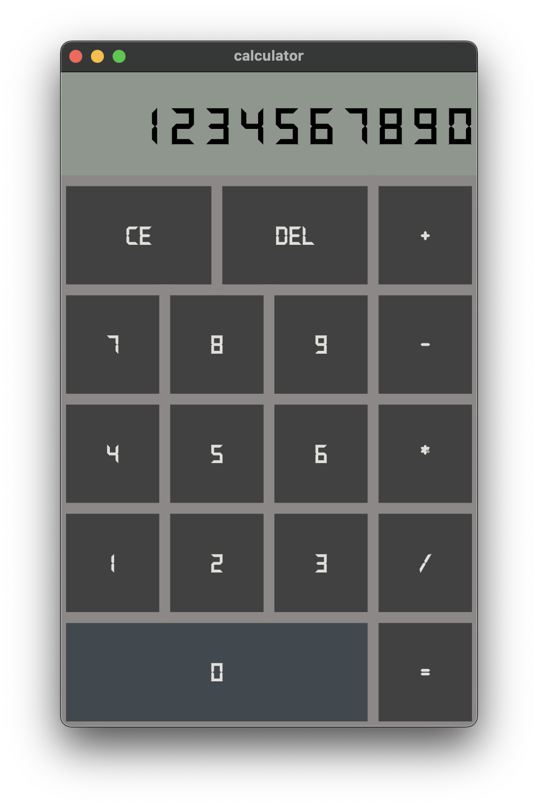

# Calculator

My very first flutter project. A simple calculator app that can perform basic arithmetic operations.

## Key Features
- State Management using Stateful Widgets
- Custom Widgets
- Custom Fonts used
- Styling and layouting using Flutter's inbuilt widgets

## Screenshot

